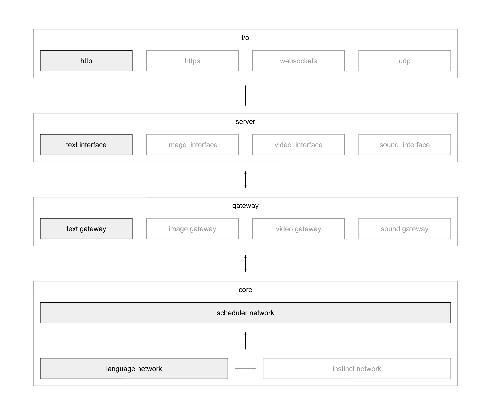

# anna
Anna, artificial neural network aspiration, is a neural network implementation
aiming to learn and improve by itself.

### abstract
There are a lot of really good ideas towards machine learning and AI out there.
As soon as there is anything that helps Anna reaching the next level of
intelligence, it is worth considering it. The artificial neural
[network](network.md) described here does not align that much with the commonly
implemented neural networks.
[Perception](https://en.wikipedia.org/wiki/Perceptron) like neural networks are
manually layered and only provide quite dumb activation functions to "connect"
to other neurons. The network being created by connections described here is
way more advanced and dynamic. Layers are not hard coded. Instead there are
dynamic [connections](connection.md) being executed based on contextual
relativity. There is no static [activation
function](https://en.wikipedia.org/wiki/Activation_function). Instead
connections are considered based on contextual relevance with respect to their
weight within the current context. The problems being able to be solved are not
limited due to static implementations. Instead the implementation of the Anna
project provides general purpose intelligence using pluggable [CLGs](clg.md).
Anyway, the concepts described in this documentation, draw pictures about the
ideas behind Anna's inner workings.

### CLG
A [CLG](clg.md), a complex logic gate, provides an implementation of a
fundamental functionality. This can be anything. E.g. summing up two numbers,
concatenating two strings and so on. You get the idea. CLGs solve some very
limited and specific problem. The very simple trick we make use of, is
combining CLGs, to form more complex strategies that are capable of solving
more complex problems. The theory is, that at some point, having enough proper
CLGs available and connected, an intelligence explosion takes place.

### connection
The [connection](connection.md) between information and behaviour is another
very important key during the creation of knowledge and intelligence. Here it
is more important what we do not predefine, than what we simply hard code. The
trick in finding the right connections is to let peers decide on their own,
based on data. Human bias needs to be prevented as much as possible. It will
help to provide some sort of bias in certain situations, but in general
connections need to be found by the peers they are using them.

### backpropagation
Backpropagation is a term originating from the scientific field of machine
learning. It is used in neural networks to propagate results back to the layer
that initialized a computation. This allows information to flow back and to
modify the way the computation is processed. That way, the circle is closed.
E.g. a neural network knows about different arithmetics (+, -, *, /). It is
asked to compute the sum of two numbers. For training reasons it is also
provided an expected result. The neural net is not implemented to act as a
calculator, but it can find out how to do so. It takes the two numbers and
tries out what happens when it feeds its known arithmetics. The results are
compared against the initially given expected result. In case of an mismatch,
this information, that the current iteration did not solve the given problem,
is backpropagated and used to learn based on failure the same way as humans do.
At some point there will be enough iterations to actually calculate the sum of
two numbers as requested. From then on, based on its experience, the neural
network will be able to calculate the sum of two numbers instantly, because it
already knows how to do so.

### challenges
Making the described concept successful is a matter of challenges, their
complexity and their order in which Anna learns from them. Having a shit load
of CLGs and letting Anna backpropagate on problems that are way to complex at
the beginning will lead to nowhere. It is important what types of challenges
she solves, and in which order she solves such challenges. Compare that to the
average person not familar with chemistry. When you ask me to cause a specific
chemical reaction using some chemicals, I will probably only blow up the lab.
Thus it is important how we teach Anna.

### modification
To reach the AI level of intelligence a lot of modifications in the code base
need to happen. In the first place this modifications need to be done by humans
within ones lifestime. It is very very unlikely that all modifications
necessary to reach the AI level can be done by humans. The necessary work is
way to complex and time consuming. Only the coordination of humans might be an
issue here. Thus the overall goal to make AI happen is to make Anna be able to
modify herself. In case this is done, it is then only a matter of a rather
small time span until the intelligence explosion happens.

### overview
This is the ten thousand feet view of Anna. To understand how she looks like
from the very top we consider the following layers.

- The `i/o` layer describes a set of network protocols Anna understands. Data
  can be written to and retrieved from her over network. I/O is flowing to and
  coming from the server.

- The `server` layer describes the actual server listening for traffic of
  implemented network protocols. It provides so called
  [interfaces](interface.md) that are used to differentiate between different
  types of inputs that serve different types of purposes.

- The `network` layer describes the implementation of Anna's most inner
  workings. This can be seen as the neural network. It bundles everything
  around data processing and intelligence. The network itself contains
  [CLGs](clg.md) acting as some sort of artificial neurons. They connect to
  each other and form the network.

- The `storage` layer describes the data storage responsible for storing any
  kind of information like the neural [connections](connection.md). This can be
  seen as Anna's memory.

This is how it basically looks like. Note that the pale boxes represent ideas
that are not yet implemented.

