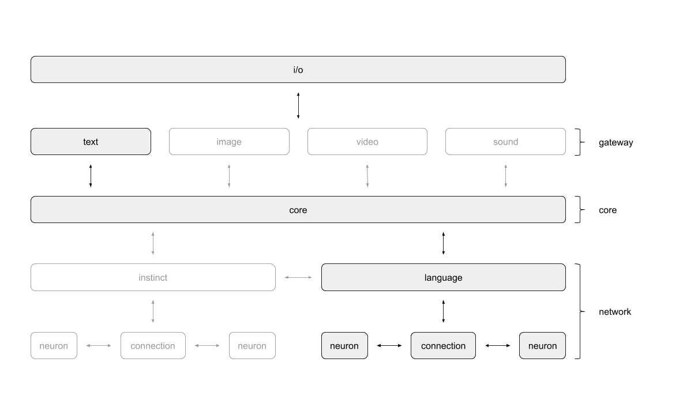

# core
The `core` is the implementation of Anna's neural networks. The core bundles
everything around data processing and intelligence. It provides `gateways` were
i/o is goint through. The core itself can contain multiple `networks`. Network
implementations provide `neurons` that interact using `connections`.

