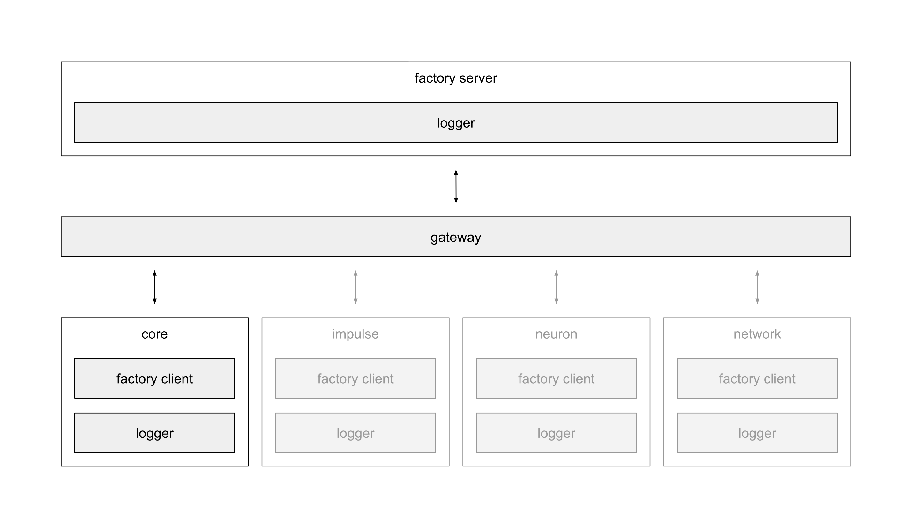

# factory
A factory is something that creates new things. Here it is about creating new
objects.

The factory concept solves the problem of dependency injection.  Objects need
to be able to create new objects on demand. Those objects need to be properly
configured with e.g. a logger. Passing these dependencies all the way through
the deeps of the code is messy and can lead to bad design. Hard maintainability
and testability would be the result.

So we have a central factory server that is properly configured ones. The
factory server is accessible through a gateway. At first the core network is
configured with a factory client that in turn is configured with the factory
gateway as well. That way the core network, and all other objects which demands
this, are able to talk to the factory server in a decoupled manner and can
simply request all kind of objects. All objects the factory server creates are
also configured with the factory client. Thus they are also able to call the
factory server.

The following illustration shows the basic concept of the factory.

