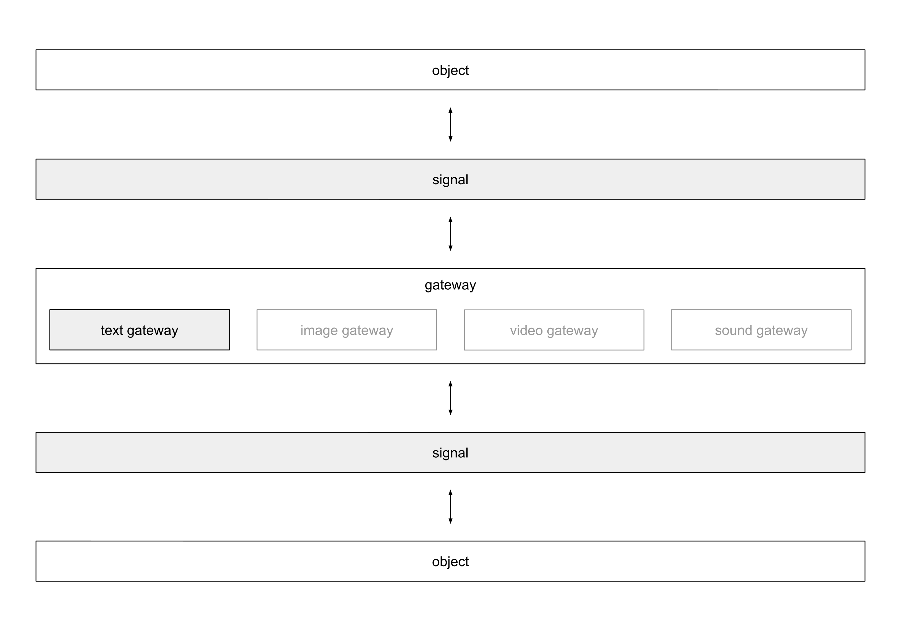

# gateway
A gateway is a in memory communication channel between objects. It decouples
objects by design using signals being send through the gateway. A signal can
transport arbitrary information. The following illustration describes how the
usage of a gateway works when sending signals between objects.

